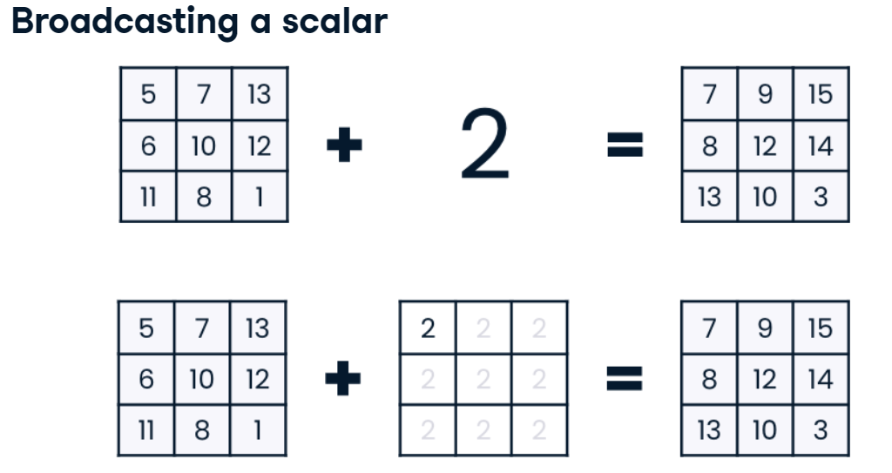

export const quartoRawHtml =
[`<pre style="white-space:pre;overflow-x:auto;line-height:normal;font-family:Menlo,'DejaVu Sans Mono',consolas,'Courier New',monospace">Broadcasting de 1<span style="color: #008080; text-decoration-color: #008080; font-weight: bold">0x5</span> + 1x5
</pre>`,`<pre style="white-space:pre;overflow-x:auto;line-height:normal;font-family:Menlo,'DejaVu Sans Mono',consolas,'Courier New',monospace"><span style="font-weight: bold">[[</span> <span style="color: #008080; text-decoration-color: #008080; font-weight: bold">9</span>  <span style="color: #008080; text-decoration-color: #008080; font-weight: bold">2</span>  <span style="color: #008080; text-decoration-color: #008080; font-weight: bold">6</span>  <span style="color: #008080; text-decoration-color: #008080; font-weight: bold">5</span>  <span style="color: #008080; text-decoration-color: #008080; font-weight: bold">1</span><span style="font-weight: bold">]</span>
 <span style="font-weight: bold">[</span> <span style="color: #008080; text-decoration-color: #008080; font-weight: bold">5</span>  <span style="color: #008080; text-decoration-color: #008080; font-weight: bold">9</span> <span style="color: #008080; text-decoration-color: #008080; font-weight: bold">10</span> <span style="color: #008080; text-decoration-color: #008080; font-weight: bold">10</span>  <span style="color: #008080; text-decoration-color: #008080; font-weight: bold">8</span><span style="font-weight: bold">]</span>
 <span style="font-weight: bold">[</span> <span style="color: #008080; text-decoration-color: #008080; font-weight: bold">6</span>  <span style="color: #008080; text-decoration-color: #008080; font-weight: bold">9</span>  <span style="color: #008080; text-decoration-color: #008080; font-weight: bold">3</span> <span style="color: #008080; text-decoration-color: #008080; font-weight: bold">10</span>  <span style="color: #008080; text-decoration-color: #008080; font-weight: bold">3</span><span style="font-weight: bold">]</span>
 <span style="font-weight: bold">[</span> <span style="color: #008080; text-decoration-color: #008080; font-weight: bold">8</span>  <span style="color: #008080; text-decoration-color: #008080; font-weight: bold">8</span>  <span style="color: #008080; text-decoration-color: #008080; font-weight: bold">7</span>  <span style="color: #008080; text-decoration-color: #008080; font-weight: bold">4</span>  <span style="color: #008080; text-decoration-color: #008080; font-weight: bold">8</span><span style="font-weight: bold">]</span>
 <span style="font-weight: bold">[</span> <span style="color: #008080; text-decoration-color: #008080; font-weight: bold">5</span>  <span style="color: #008080; text-decoration-color: #008080; font-weight: bold">2</span>  <span style="color: #008080; text-decoration-color: #008080; font-weight: bold">6</span> <span style="color: #008080; text-decoration-color: #008080; font-weight: bold">10</span>  <span style="color: #008080; text-decoration-color: #008080; font-weight: bold">5</span><span style="font-weight: bold">]</span>
 <span style="font-weight: bold">[</span> <span style="color: #008080; text-decoration-color: #008080; font-weight: bold">7</span>  <span style="color: #008080; text-decoration-color: #008080; font-weight: bold">9</span>  <span style="color: #008080; text-decoration-color: #008080; font-weight: bold">9</span>  <span style="color: #008080; text-decoration-color: #008080; font-weight: bold">8</span>  <span style="color: #008080; text-decoration-color: #008080; font-weight: bold">3</span><span style="font-weight: bold">]</span>
 <span style="font-weight: bold">[</span> <span style="color: #008080; text-decoration-color: #008080; font-weight: bold">7</span>  <span style="color: #008080; text-decoration-color: #008080; font-weight: bold">5</span>  <span style="color: #008080; text-decoration-color: #008080; font-weight: bold">3</span>  <span style="color: #008080; text-decoration-color: #008080; font-weight: bold">5</span>  <span style="color: #008080; text-decoration-color: #008080; font-weight: bold">7</span><span style="font-weight: bold">]</span>
 <span style="font-weight: bold">[</span> <span style="color: #008080; text-decoration-color: #008080; font-weight: bold">4</span>  <span style="color: #008080; text-decoration-color: #008080; font-weight: bold">7</span>  <span style="color: #008080; text-decoration-color: #008080; font-weight: bold">7</span>  <span style="color: #008080; text-decoration-color: #008080; font-weight: bold">3</span>  <span style="color: #008080; text-decoration-color: #008080; font-weight: bold">1</span><span style="font-weight: bold">]</span>
 <span style="font-weight: bold">[</span> <span style="color: #008080; text-decoration-color: #008080; font-weight: bold">2</span>  <span style="color: #008080; text-decoration-color: #008080; font-weight: bold">8</span>  <span style="color: #008080; text-decoration-color: #008080; font-weight: bold">6</span> <span style="color: #008080; text-decoration-color: #008080; font-weight: bold">12</span>  <span style="color: #008080; text-decoration-color: #008080; font-weight: bold">7</span><span style="font-weight: bold">]</span>
 <span style="font-weight: bold">[</span> <span style="color: #008080; text-decoration-color: #008080; font-weight: bold">9</span>  <span style="color: #008080; text-decoration-color: #008080; font-weight: bold">9</span> <span style="color: #008080; text-decoration-color: #008080; font-weight: bold">12</span> <span style="color: #008080; text-decoration-color: #008080; font-weight: bold">10</span> <span style="color: #008080; text-decoration-color: #008080; font-weight: bold">10</span><span style="font-weight: bold">]]</span>
</pre>`,`<pre style="white-space:pre;overflow-x:auto;line-height:normal;font-family:Menlo,'DejaVu Sans Mono',consolas,'Courier New',monospace">Broadcasting de 1<span style="color: #008080; text-decoration-color: #008080; font-weight: bold">0x5</span> + <span style="color: #008080; text-decoration-color: #008080; font-weight: bold">5</span>
</pre>`,`<pre style="white-space:pre;overflow-x:auto;line-height:normal;font-family:Menlo,'DejaVu Sans Mono',consolas,'Courier New',monospace"><span style="font-weight: bold">[[</span> <span style="color: #008080; text-decoration-color: #008080; font-weight: bold">7</span> <span style="color: #008080; text-decoration-color: #008080; font-weight: bold">11</span>  <span style="color: #008080; text-decoration-color: #008080; font-weight: bold">9</span>  <span style="color: #008080; text-decoration-color: #008080; font-weight: bold">2</span>  <span style="color: #008080; text-decoration-color: #008080; font-weight: bold">5</span><span style="font-weight: bold">]</span>
 <span style="font-weight: bold">[</span> <span style="color: #008080; text-decoration-color: #008080; font-weight: bold">3</span> <span style="color: #008080; text-decoration-color: #008080; font-weight: bold">18</span> <span style="color: #008080; text-decoration-color: #008080; font-weight: bold">13</span>  <span style="color: #008080; text-decoration-color: #008080; font-weight: bold">7</span> <span style="color: #008080; text-decoration-color: #008080; font-weight: bold">12</span><span style="font-weight: bold">]</span>
 <span style="font-weight: bold">[</span> <span style="color: #008080; text-decoration-color: #008080; font-weight: bold">4</span> <span style="color: #008080; text-decoration-color: #008080; font-weight: bold">18</span>  <span style="color: #008080; text-decoration-color: #008080; font-weight: bold">6</span>  <span style="color: #008080; text-decoration-color: #008080; font-weight: bold">7</span>  <span style="color: #008080; text-decoration-color: #008080; font-weight: bold">7</span><span style="font-weight: bold">]</span>
 <span style="font-weight: bold">[</span> <span style="color: #008080; text-decoration-color: #008080; font-weight: bold">6</span> <span style="color: #008080; text-decoration-color: #008080; font-weight: bold">17</span> <span style="color: #008080; text-decoration-color: #008080; font-weight: bold">10</span>  <span style="color: #008080; text-decoration-color: #008080; font-weight: bold">1</span> <span style="color: #008080; text-decoration-color: #008080; font-weight: bold">12</span><span style="font-weight: bold">]</span>
 <span style="font-weight: bold">[</span> <span style="color: #008080; text-decoration-color: #008080; font-weight: bold">3</span> <span style="color: #008080; text-decoration-color: #008080; font-weight: bold">11</span>  <span style="color: #008080; text-decoration-color: #008080; font-weight: bold">9</span>  <span style="color: #008080; text-decoration-color: #008080; font-weight: bold">7</span>  <span style="color: #008080; text-decoration-color: #008080; font-weight: bold">9</span><span style="font-weight: bold">]</span>
 <span style="font-weight: bold">[</span> <span style="color: #008080; text-decoration-color: #008080; font-weight: bold">5</span> <span style="color: #008080; text-decoration-color: #008080; font-weight: bold">18</span> <span style="color: #008080; text-decoration-color: #008080; font-weight: bold">12</span>  <span style="color: #008080; text-decoration-color: #008080; font-weight: bold">5</span>  <span style="color: #008080; text-decoration-color: #008080; font-weight: bold">7</span><span style="font-weight: bold">]</span>
 <span style="font-weight: bold">[</span> <span style="color: #008080; text-decoration-color: #008080; font-weight: bold">5</span> <span style="color: #008080; text-decoration-color: #008080; font-weight: bold">14</span>  <span style="color: #008080; text-decoration-color: #008080; font-weight: bold">6</span>  <span style="color: #008080; text-decoration-color: #008080; font-weight: bold">2</span> <span style="color: #008080; text-decoration-color: #008080; font-weight: bold">11</span><span style="font-weight: bold">]</span>
 <span style="font-weight: bold">[</span> <span style="color: #008080; text-decoration-color: #008080; font-weight: bold">2</span> <span style="color: #008080; text-decoration-color: #008080; font-weight: bold">16</span> <span style="color: #008080; text-decoration-color: #008080; font-weight: bold">10</span>  <span style="color: #008080; text-decoration-color: #008080; font-weight: bold">0</span>  <span style="color: #008080; text-decoration-color: #008080; font-weight: bold">5</span><span style="font-weight: bold">]</span>
 <span style="font-weight: bold">[</span> <span style="color: #008080; text-decoration-color: #008080; font-weight: bold">0</span> <span style="color: #008080; text-decoration-color: #008080; font-weight: bold">17</span>  <span style="color: #008080; text-decoration-color: #008080; font-weight: bold">9</span>  <span style="color: #008080; text-decoration-color: #008080; font-weight: bold">9</span> <span style="color: #008080; text-decoration-color: #008080; font-weight: bold">11</span><span style="font-weight: bold">]</span>
 <span style="font-weight: bold">[</span> <span style="color: #008080; text-decoration-color: #008080; font-weight: bold">7</span> <span style="color: #008080; text-decoration-color: #008080; font-weight: bold">18</span> <span style="color: #008080; text-decoration-color: #008080; font-weight: bold">15</span>  <span style="color: #008080; text-decoration-color: #008080; font-weight: bold">7</span> <span style="color: #008080; text-decoration-color: #008080; font-weight: bold">14</span><span style="font-weight: bold">]]</span>
</pre>`,`<pre style="white-space:pre;overflow-x:auto;line-height:normal;font-family:Menlo,'DejaVu Sans Mono',consolas,'Courier New',monospace">Broadcasting de 1<span style="color: #008080; text-decoration-color: #008080; font-weight: bold">0x5</span> + 1<span style="color: #008080; text-decoration-color: #008080; font-weight: bold">0x1</span>
</pre>`,`<pre style="white-space:pre;overflow-x:auto;line-height:normal;font-family:Menlo,'DejaVu Sans Mono',consolas,'Courier New',monospace"><span style="font-weight: bold">[[</span><span style="color: #008080; text-decoration-color: #008080; font-weight: bold">14</span>  <span style="color: #008080; text-decoration-color: #008080; font-weight: bold">9</span> <span style="color: #008080; text-decoration-color: #008080; font-weight: bold">10</span>  <span style="color: #008080; text-decoration-color: #008080; font-weight: bold">9</span>  <span style="color: #008080; text-decoration-color: #008080; font-weight: bold">7</span><span style="font-weight: bold">]</span>
 <span style="font-weight: bold">[</span> <span style="color: #008080; text-decoration-color: #008080; font-weight: bold">5</span> <span style="color: #008080; text-decoration-color: #008080; font-weight: bold">11</span>  <span style="color: #008080; text-decoration-color: #008080; font-weight: bold">9</span>  <span style="color: #008080; text-decoration-color: #008080; font-weight: bold">9</span>  <span style="color: #008080; text-decoration-color: #008080; font-weight: bold">9</span><span style="font-weight: bold">]</span>
 <span style="font-weight: bold">[</span> <span style="color: #008080; text-decoration-color: #008080; font-weight: bold">5</span> <span style="color: #008080; text-decoration-color: #008080; font-weight: bold">10</span>  <span style="color: #008080; text-decoration-color: #008080; font-weight: bold">1</span>  <span style="color: #008080; text-decoration-color: #008080; font-weight: bold">8</span>  <span style="color: #008080; text-decoration-color: #008080; font-weight: bold">3</span><span style="font-weight: bold">]</span>
 <span style="font-weight: bold">[</span><span style="color: #008080; text-decoration-color: #008080; font-weight: bold">11</span> <span style="color: #008080; text-decoration-color: #008080; font-weight: bold">13</span>  <span style="color: #008080; text-decoration-color: #008080; font-weight: bold">9</span>  <span style="color: #008080; text-decoration-color: #008080; font-weight: bold">6</span> <span style="color: #008080; text-decoration-color: #008080; font-weight: bold">12</span><span style="font-weight: bold">]</span>
 <span style="font-weight: bold">[</span> <span style="color: #008080; text-decoration-color: #008080; font-weight: bold">9</span>  <span style="color: #008080; text-decoration-color: #008080; font-weight: bold">8</span>  <span style="color: #008080; text-decoration-color: #008080; font-weight: bold">9</span> <span style="color: #008080; text-decoration-color: #008080; font-weight: bold">13</span> <span style="color: #008080; text-decoration-color: #008080; font-weight: bold">10</span><span style="font-weight: bold">]</span>
 <span style="font-weight: bold">[</span><span style="color: #008080; text-decoration-color: #008080; font-weight: bold">11</span> <span style="color: #008080; text-decoration-color: #008080; font-weight: bold">15</span> <span style="color: #008080; text-decoration-color: #008080; font-weight: bold">12</span> <span style="color: #008080; text-decoration-color: #008080; font-weight: bold">11</span>  <span style="color: #008080; text-decoration-color: #008080; font-weight: bold">8</span><span style="font-weight: bold">]</span>
 <span style="font-weight: bold">[</span> <span style="color: #008080; text-decoration-color: #008080; font-weight: bold">6</span>  <span style="color: #008080; text-decoration-color: #008080; font-weight: bold">6</span>  <span style="color: #008080; text-decoration-color: #008080; font-weight: bold">1</span>  <span style="color: #008080; text-decoration-color: #008080; font-weight: bold">3</span>  <span style="color: #008080; text-decoration-color: #008080; font-weight: bold">7</span><span style="font-weight: bold">]</span>
 <span style="font-weight: bold">[</span> <span style="color: #008080; text-decoration-color: #008080; font-weight: bold">3</span>  <span style="color: #008080; text-decoration-color: #008080; font-weight: bold">8</span>  <span style="color: #008080; text-decoration-color: #008080; font-weight: bold">5</span>  <span style="color: #008080; text-decoration-color: #008080; font-weight: bold">1</span>  <span style="color: #008080; text-decoration-color: #008080; font-weight: bold">1</span><span style="font-weight: bold">]</span>
 <span style="font-weight: bold">[</span> <span style="color: #008080; text-decoration-color: #008080; font-weight: bold">8</span> <span style="color: #008080; text-decoration-color: #008080; font-weight: bold">16</span> <span style="color: #008080; text-decoration-color: #008080; font-weight: bold">11</span> <span style="color: #008080; text-decoration-color: #008080; font-weight: bold">17</span> <span style="color: #008080; text-decoration-color: #008080; font-weight: bold">14</span><span style="font-weight: bold">]</span>
 <span style="font-weight: bold">[</span> <span style="color: #008080; text-decoration-color: #008080; font-weight: bold">7</span>  <span style="color: #008080; text-decoration-color: #008080; font-weight: bold">9</span>  <span style="color: #008080; text-decoration-color: #008080; font-weight: bold">9</span>  <span style="color: #008080; text-decoration-color: #008080; font-weight: bold">7</span>  <span style="color: #008080; text-decoration-color: #008080; font-weight: bold">9</span><span style="font-weight: bold">]]</span>
</pre>`,`<pre style="white-space:pre;overflow-x:auto;line-height:normal;font-family:Menlo,'DejaVu Sans Mono',consolas,'Courier New',monospace"><span style="font-weight: bold">[[</span><span style="color: #008080; text-decoration-color: #008080; font-weight: bold">12</span>  <span style="color: #008080; text-decoration-color: #008080; font-weight: bold">7</span>  <span style="color: #008080; text-decoration-color: #008080; font-weight: bold">8</span>  <span style="color: #008080; text-decoration-color: #008080; font-weight: bold">7</span>  <span style="color: #008080; text-decoration-color: #008080; font-weight: bold">5</span><span style="font-weight: bold">]</span>
 <span style="font-weight: bold">[</span> <span style="color: #008080; text-decoration-color: #008080; font-weight: bold">8</span> <span style="color: #008080; text-decoration-color: #008080; font-weight: bold">14</span> <span style="color: #008080; text-decoration-color: #008080; font-weight: bold">12</span> <span style="color: #008080; text-decoration-color: #008080; font-weight: bold">12</span> <span style="color: #008080; text-decoration-color: #008080; font-weight: bold">12</span><span style="font-weight: bold">]</span>
 <span style="font-weight: bold">[</span> <span style="color: #008080; text-decoration-color: #008080; font-weight: bold">9</span> <span style="color: #008080; text-decoration-color: #008080; font-weight: bold">14</span>  <span style="color: #008080; text-decoration-color: #008080; font-weight: bold">5</span> <span style="color: #008080; text-decoration-color: #008080; font-weight: bold">12</span>  <span style="color: #008080; text-decoration-color: #008080; font-weight: bold">7</span><span style="font-weight: bold">]</span>
 <span style="font-weight: bold">[</span><span style="color: #008080; text-decoration-color: #008080; font-weight: bold">11</span> <span style="color: #008080; text-decoration-color: #008080; font-weight: bold">13</span>  <span style="color: #008080; text-decoration-color: #008080; font-weight: bold">9</span>  <span style="color: #008080; text-decoration-color: #008080; font-weight: bold">6</span> <span style="color: #008080; text-decoration-color: #008080; font-weight: bold">12</span><span style="font-weight: bold">]</span>
 <span style="font-weight: bold">[</span> <span style="color: #008080; text-decoration-color: #008080; font-weight: bold">8</span>  <span style="color: #008080; text-decoration-color: #008080; font-weight: bold">7</span>  <span style="color: #008080; text-decoration-color: #008080; font-weight: bold">8</span> <span style="color: #008080; text-decoration-color: #008080; font-weight: bold">12</span>  <span style="color: #008080; text-decoration-color: #008080; font-weight: bold">9</span><span style="font-weight: bold">]</span>
 <span style="font-weight: bold">[</span><span style="color: #008080; text-decoration-color: #008080; font-weight: bold">10</span> <span style="color: #008080; text-decoration-color: #008080; font-weight: bold">14</span> <span style="color: #008080; text-decoration-color: #008080; font-weight: bold">11</span> <span style="color: #008080; text-decoration-color: #008080; font-weight: bold">10</span>  <span style="color: #008080; text-decoration-color: #008080; font-weight: bold">7</span><span style="font-weight: bold">]</span>
 <span style="font-weight: bold">[</span><span style="color: #008080; text-decoration-color: #008080; font-weight: bold">10</span> <span style="color: #008080; text-decoration-color: #008080; font-weight: bold">10</span>  <span style="color: #008080; text-decoration-color: #008080; font-weight: bold">5</span>  <span style="color: #008080; text-decoration-color: #008080; font-weight: bold">7</span> <span style="color: #008080; text-decoration-color: #008080; font-weight: bold">11</span><span style="font-weight: bold">]</span>
 <span style="font-weight: bold">[</span> <span style="color: #008080; text-decoration-color: #008080; font-weight: bold">7</span> <span style="color: #008080; text-decoration-color: #008080; font-weight: bold">12</span>  <span style="color: #008080; text-decoration-color: #008080; font-weight: bold">9</span>  <span style="color: #008080; text-decoration-color: #008080; font-weight: bold">5</span>  <span style="color: #008080; text-decoration-color: #008080; font-weight: bold">5</span><span style="font-weight: bold">]</span>
 <span style="font-weight: bold">[</span> <span style="color: #008080; text-decoration-color: #008080; font-weight: bold">5</span> <span style="color: #008080; text-decoration-color: #008080; font-weight: bold">13</span>  <span style="color: #008080; text-decoration-color: #008080; font-weight: bold">8</span> <span style="color: #008080; text-decoration-color: #008080; font-weight: bold">14</span> <span style="color: #008080; text-decoration-color: #008080; font-weight: bold">11</span><span style="font-weight: bold">]</span>
 <span style="font-weight: bold">[</span><span style="color: #008080; text-decoration-color: #008080; font-weight: bold">12</span> <span style="color: #008080; text-decoration-color: #008080; font-weight: bold">14</span> <span style="color: #008080; text-decoration-color: #008080; font-weight: bold">14</span> <span style="color: #008080; text-decoration-color: #008080; font-weight: bold">12</span> <span style="color: #008080; text-decoration-color: #008080; font-weight: bold">14</span><span style="font-weight: bold">]]</span>
</pre>`,`<pre style="white-space:pre;overflow-x:auto;line-height:normal;font-family:Menlo,'DejaVu Sans Mono',consolas,'Courier New',monospace">Broadcasting de 1<span style="color: #008080; text-decoration-color: #008080; font-weight: bold">0x5</span> + 5x10
</pre>`,`<pre style="white-space:pre;overflow-x:auto;line-height:normal;font-family:Menlo,'DejaVu Sans Mono',consolas,'Courier New',monospace">Broadcasting de 1<span style="color: #008080; text-decoration-color: #008080; font-weight: bold">0x5</span> + <span style="color: #008080; text-decoration-color: #008080; font-weight: bold">10</span>
</pre>`];

# Broadcasting con NumPy {#broadcasting-con-numpy}



El broadcasting es una forma de hacer operaciones entre arrays de
diferentes tamaños, que usualmente no son compatibles. El broadcasting
es posible cuando se cumplen ciertas reglas.

-   El tamaño de cada dimensión es igual.
-   Una de las dimensiones es 1.

El broadcasting se realiza en la dimensión que tiene tamaño 1. El array
con tamaño 1 se extiende para que tenga el mismo tamaño que el otro
array.

## Ejemplos de broadcasting {#ejemplos-de-broadcasting}

| Array 1 | Array 2 | Resultado |
|---------|---------|-----------|
| 10 x 5  | 1 x 5   | 10 x 5    |
| 10 x 5  | 5       | 10 x 5    |
| 10 x 5  | 10 x 1  | 10 x 5    |
| 10 x 5  | scalar  | 10 x 5    |

``` python
import numpy as np
from rich import print
# matris de 10x5 
m10_5 = np.random.randint(0, 10, (10, 5))
m1_5 = np.random.randint(0, 10, (1, 5))
m5 = np.random.randint(0, 10, (5))
m10_1 = np.random.randint(0, 10, (10, 1))
scalar = 5

print('Broadcasting de 10x5 + 1x5')
print(m10_5 + m1_5)
print('Broadcasting de 10x5 + 5')
print(m10_5 + m5)
print('Broadcasting de 10x5 + 10x1')
print(m10_5 + m10_1)
print(m10_5 + scalar)
```

<div dangerouslySetInnerHTML={{ __html: quartoRawHtml[0] }} />

<div dangerouslySetInnerHTML={{ __html: quartoRawHtml[1] }} />

<div dangerouslySetInnerHTML={{ __html: quartoRawHtml[2] }} />

<div dangerouslySetInnerHTML={{ __html: quartoRawHtml[3] }} />

<div dangerouslySetInnerHTML={{ __html: quartoRawHtml[4] }} />

<div dangerouslySetInnerHTML={{ __html: quartoRawHtml[5] }} />

<div dangerouslySetInnerHTML={{ __html: quartoRawHtml[6] }} />

## Ejemplos de no broadcasting {#ejemplos-de-no-broadcasting}

| Array 1 | Array 2 | Resultado |
|---------|---------|-----------|
| 10 x 5  | 5 x 10  | Error     |
| 10 x 5  | 10      | Error     |

``` python
m10_5 = np.random.randint(0, 10, (10, 5))
m5_10 = np.random.randint(0, 10, (5, 10))
m10 = np.random.randint(0, 10, (10))

print('Broadcasting de 10x5 + 5x10')
print(m10_5 + m5_10)
```

<div dangerouslySetInnerHTML={{ __html: quartoRawHtml[7] }} />

``` text
ValueError: operands could not be broadcast together with shapes (10,5) (5,10) 
```

``` python
print('Broadcasting de 10x5 + 10')
print(m10_5 + m10)
```

<div dangerouslySetInnerHTML={{ __html: quartoRawHtml[8] }} />

``` text
ValueError: operands could not be broadcast together with shapes (10,5) (10,) 
```

