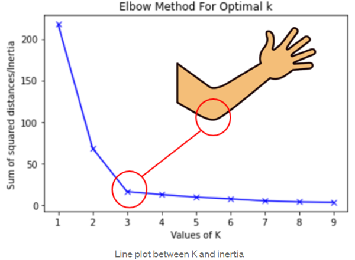

# Clustering

## ¿Que es clustering?

Clustering es un método de aprendizaje no supervisado, que consiste en agrupar un conjunto de objetos de tal manera que los objetos del mismo grupo (o cluster) sean más similares (en algún sentido o en algún aspecto) entre sí que los de otros grupos.

## k-means

k-means es un algoritmo de clustering que consiste en agrupar un conjunto de objetos de tal manera que los objetos del mismo grupo (o cluster) sean más similares (en algún sentido o en algún aspecto) entre sí que los de otros grupos.

### Algoritmo  de k-means

1. Inicializar los centroides de los clusters aleatoriamente (k puntos): $\mu_1, \mu_2, ..., \mu_k$

$$
\begin{align} 
    repeat \{ \\
        & \# Asignar \ puntos \ a \ los \ centroides \ del \ cluster \\ 
        & \text{for } i = 1 \text{ to } m \\
        & \quad c^{(i)} := \text{índice (de 1 a k) del centroide más cercano a } x^{(i)} \\
        & \# \ Mover \ los \ centroides \ de \ los \ clusters \\
        & \text{for } k = 1 \text{ to } k \\
        & \quad u_k := \text{promedio de los puntos asignados al cluster } k \\
    \} \\
\end{align}
$$

### k-means optimización objetivo

* $c^{(i)}$ = índice del cluster (1, 2, ..., k) al que se asigna el ejemplo $x^{(i)}$
* $u_k$ = vector de parámetros del centroide del cluster $k$ 
* $\mu_{c^{(i)}}$ = vector de parámetros del centroide del cluster al que se asigna el ejemplo $x^{(i)}$

**Función de costo**

$$J(c^{(1)}, ..., c^{(m)}, \mu_1, ..., \mu_k) = \frac{1}{m} \sum_{i=1}^{m} ||x^{(i)} - \mu_{c^{(i)}}||^2$$

**Objetivo**: Encontrar $c^{(1)}, ..., c^{(m)}, \mu_1, ..., \mu_k$ que minimicen $J$.

$$min_{c^{(1)}, ..., c^{(m)}, \mu_1, ..., \mu_k} J(c^{(1)}, ..., c^{(m)}, \mu_1, ..., \mu_k)$$

### Inicializando k-means

* **Seleccionar aleatoriamente** $k$ ejemplos de entrenamiento $x^{(1)}, ..., x^{(k)}$ que servirán como los centroides iniciales: $\mu_1, ..., \mu_k$.

### Elección del número de clusters

**¿Cual es el número de clusters óptimo?**

Para elegir el número de clusters óptimo se puede utilizar los siguientes 2 métodos:

* **Método del codo**: el metodo del codo consiste en graficar el valor de la función de costo $J$ en función del número de clusters $k$. El número de clusters óptimo será el valor de $k$ en el que la función de costo $J$ se "quiebre" o tenga un cambio de pendiente más pronunciado.

No es una buena métrica para elegir el número de clusters óptimo, ya que no siempre se puede identificar un cambio de pendiente claro en la gráfica, no hay un codo claro. 

la elección del número de clusters es subjetiva, depende de la aplicación y del contexto.