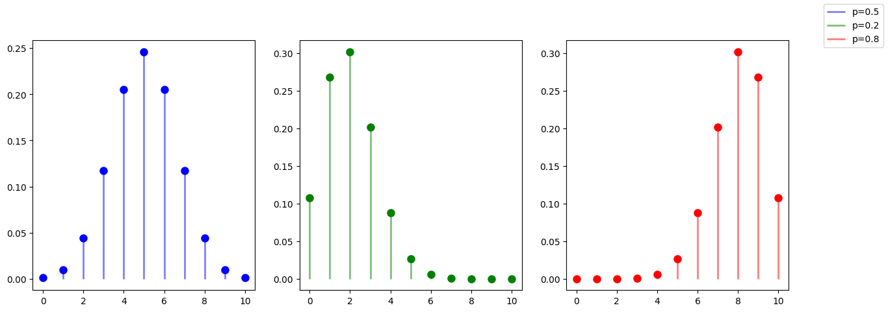
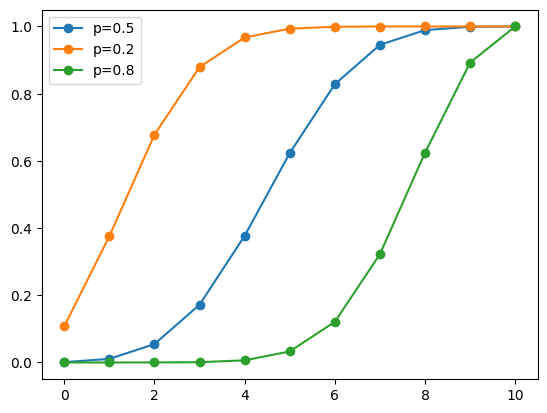
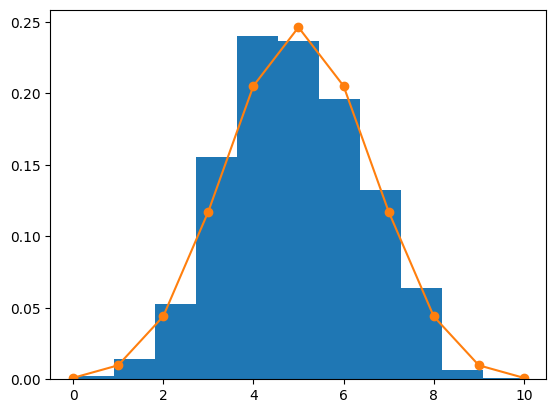

# Distrbución Binomial - python {#distrbución-binomial---python}

La distribución binomial es un modelo de probabilidad discreta que
cuenta el número de éxitos en una secuencia de $n$ ensayos de Bernoulli
independientes entre sí, con una probabilidad fija $p$ de ocurrencia del
éxito entre los ensayos. Un experimento de Bernoulli se caracteriza por
ser dicotómico, esto es, sólo son posibles dos resultados. A uno de
estos se denomina éxito y tiene una probabilidad de ocurrencia $p$ y al
otro, fracaso, con una probabilidad $q = 1 - p$, de ocurrencia.

## Función de probabilidad {#función-de-probabilidad}

La función de probabilidad de una distribución binomial es:

$$f(k,n,p) = P(X = k) = \binom{n}{k} p^k (1-p)^{n-k}$$

donde: \* $n$ es el número de ensayos \* $k$ es el número de éxitos \*
$p$ es la probabilidad de éxito en cada ensayo \*
$\binom{n}{k} = \frac{n!}{k!(n-k)!}$ es el coeficiente binomial

**El coeficiente binomial** $\binom{n}{k}$ es el número de formas de
escoger un subconjunto de $k$ elementos, sin importar el orden, de un
conjunto de $n$ elementos. Se lee “n sobre k”.

## Optener la distribución binomial con python {#optener-la-distribución-binomial-con-python}

Ahora usaremos python para obtener la distribución binomial de un
experimento. Para ello usaremos la función `binom` de la librería
`scipy.stats`. Esta función recibe como parámetros el número de ensayos
$n$ y la probabilidad de ocurrencia del éxito $p$.

``` bash
pip install scipy
```

``` python
from scipy.stats import binom
from matplotlib import pyplot as plt
import warnings
warnings.filterwarnings("ignore")
# Definimos los parámetros de la distribución
n = 10
p = 0.5

# Obtenemos los valores de la distribución
x = list(range(0, n+1))
pmf_5 = binom.pmf(x, n, p)

# sesgada a la derecha
p = 0.2
pmf_2 = binom.pmf(x, n, p)

# sesgada a la izquierda
p = 0.8
pmf_8 = binom.pmf(x, n, p)

# subplots
fig, axs = plt.subplots(1, 3, figsize=(15, 5))

# Graficamos
axs[0].plot(x, pmf_5, 'og', ms=8, c='b')
axs[0].vlines(x, 0, pmf_5, colors='b', lw=2, alpha=0.5, label='p=0.5')
axs[1].plot(x, pmf_2, 'og', ms=8, c='g')
axs[1].vlines(x, 0, pmf_2, colors='g', lw=2, alpha=0.5, label='p=0.2')
axs[2].plot(x, pmf_8, 'og', ms=8, c='r')
axs[2].vlines(x, 0, pmf_8, colors='r', lw=2, alpha=0.5, label='p=0.8')
fig.legend()
fig.show()
```



Copo podemos ver en el grafico si usamos una probabilidad de ocurrencia
del éxito de 0.5, la distribución es simétrica y si usamos una
probabilidad de ocurrencia del éxito mayor a 0.5, la distribución se
sesga hacia la derecha y si usamos una probabilidad de ocurrencia del
éxito menor a 0.5, la distribución se sesga hacia la izquierda.

## Función de distribución acumulada {#función-de-distribución-acumulada}

La función de distribución acumulada de una distribución binomial es:

$$F(k,n,p) = P(X \leq k) = \sum_{i=0}^k \binom{n}{i} p^i (1-p)^{n-i}$$

En terminos simples, la función de distribución acumulada es la
probabilidad de que la variable aleatoria $X$ sea menor o igual que $k$.
la suma de las probabilidades de todos los valores de $X$ menores o
iguales que $k$.

En python sería

``` python
# Definimos los parámetros de la distribución
n = 10
p = 0.5

# Obtenemos los valores de la distribución
x = list(range(0, n+1))
cdf_5 = binom.cdf(x, n, p)

# sesgada a la derecha
p = 0.2
cdf_2 = binom.cdf(x, n, p)

# sesgada a la izquierda
p = 0.8
cdf_8 = binom.cdf(x, n, p)

# Graficamos
plt.plot(x, cdf_5, 'o-', label='p=0.5')
plt.plot(x, cdf_2, 'o-', label='p=0.2')
plt.plot(x, cdf_8, 'o-', label='p=0.8')
plt.legend()
plt.show()
```



## Como generar números aleatorios con distribución binomial {#como-generar-números-aleatorios-con-distribución-binomial}

Para generar números aleatorios con distribución binomial usaremos la
función `binom.rvs` de la librería `scipy.stats`. Esta función recibe
como parámetros el número de ensayos $n$, la probabilidad de ocurrencia
del éxito $p$ y el tamaño de la muestra.

``` python
# generamos una muestra aleatoria
n = 10
p = 0.5
muestra = binom.rvs(n, p, size=1000)

# Graficamos
plt.hist(muestra, bins=11, density=True)
plt.plot(x, pmf_5, 'o-', label='p=0.5')
plt.show()
```



Como hemos podido ver trabajar con distribuciones binomiales en python
es muy sencillo y nos puede ayudar a resolver muchos problemas de
probabilidad.

