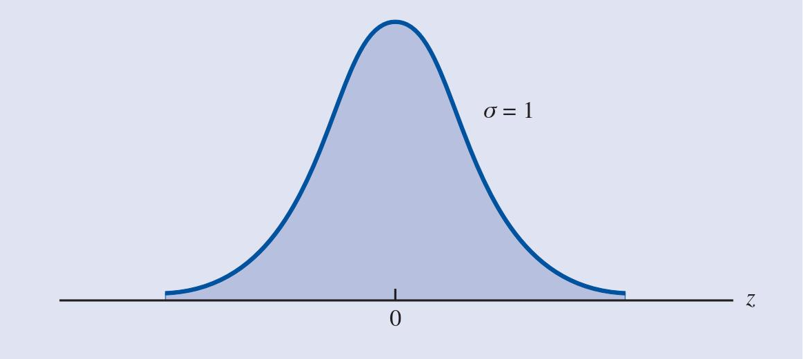

# Distribución Normal (Gaussiana)

La distribución normal es una de las distribuciones más importantes en estadística. Se utiliza para modelar una gran cantidad de fenómenos naturales, sociales y económicos.

La distribución normal es una distribución continua que se caracteriza por su campana simétrica. La media, la mediana y la moda son iguales. Además, la curva es asintótica al eje de las abscisas, es decir, se acerca cada vez más a dicho eje pero sin llegar a tocarlo.

## Función de densidad (pdf)

La función de densidad de la distribución normal es:

$$ f(x) = \frac{1}{\sigma \sqrt{2\pi}} e^{-\frac{1}{2} \left(\frac{x-\mu}{\sigma}\right)^2} $$

Donde $\mu$ es la media y $\sigma$ es la desviación estándar.

## función de distribución (cdf)

La función de distribución de la distribución normal es:

$$ F(x) = \frac{1}{\sigma \sqrt{2\pi}} \int_{-\infty}^{x} e^{-\frac{1}{2} \left(\frac{t-\mu}{\sigma}\right)^2} dt $$

Donde $\mu$ es la media y $\sigma$ es la desviación estándar.

## Notación

$$ X \sim N(\mu, \sigma^2) $$

## Propiedades

* La media, la mediana y la moda son iguales.
* La curva es simétrica respecto a la media.
* La curva es asintótica al eje de las abscisas.
* El área bajo la curva es igual a 1.
* El área bajo la curva entre dos puntos es igual a la probabilidad de que la variable aleatoria tome un valor entre esos dos puntos.
* El área bajo la curva a la izquierda de un punto es igual a la probabilidad de que la variable aleatoria tome un valor menor o igual a ese punto. $$ P(X \leq x) = F(x) $$

## Distribución normal estándar

La distribución normal estándar es aquella cuya media es 0 y su desviación estándar es 1.

