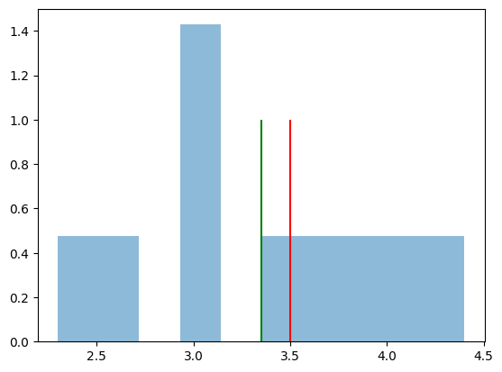
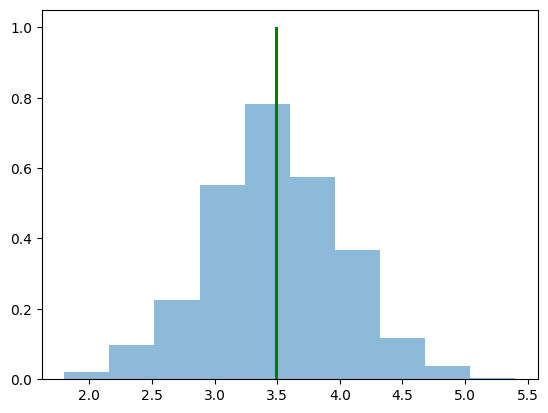

# Teorema de límite central {#teorema-de-límite-central}

El teorema del límite central (TLC) establece que, para una muestra
aleatoria de tamaño $n$, la distribución de las medias muestrales se
aproxima a una distribución normal a medida que $n$ aumenta.

Sean $X_1, X_2, \ldots, X_n$ una muestra aleatoria de tamaño $n$ de una
población con media $\mu$ y varianza $\sigma^2$. Entonces, para $n$
suficientemente grande, la variable aleatoria es:

$$Z_n = \frac{\bar{X} - \mu}{\sigma / \sqrt{n}}$$

## En python {#en-python}

Para graficar el TLC en python, usaremos un ejemplo de tirar dados.

``` python
import numpy as np  
import matplotlib.pyplot as plt
# Tiraremos 10 veces los dados y calcularemos la media 
dados = list(range(1,7))
muestra_10 = np.random.choice(dados, size=10, replace=True)
media = np.mean(muestra_10)
print("La media de la muestra es: ", media)
```

``` text
La media de la muestra es:  3.0
```

Como podemos ver la Media de esta muestra no es 3.5, hora veamos que
pasa si hacemos este mismo experimento pero 10 veces.

``` python
exp_10 = [np.mean(muestra) for muestra in np.random.choice(dados, size=(10, 10), replace=True)]

# Graficamos el histograma de las medias
plt.hist(exp_10, bins=10, density=True, alpha=0.5)
plt.vlines(3.5, 0, 1, color='red', label='Media teórica')
plt.vlines(np.mean(exp_10), 0, 1, color='green', label='Media muestral')
plt.show()
```



Ahora veamos que pasa si hacemos este mismo experimento pero 1000 veces.

``` python
exp_1000 = [np.mean(muestra) for muestra in np.random.choice(dados, size=(1000, 10), replace=True)]
# Graficamos
plt.hist(exp_1000, bins=10, density=True, alpha=0.5)
plt.vlines(3.5, 0, 1, color='red', label='Media teórica')
plt.vlines(np.mean(exp_1000), 0, 1, color='green', label='Media muestral')
plt.show()
```



Como podemos ver, a medida que aumentamos el número de experimentos, la
distribución de las medias muestrales se aproxima a una distribución
normal.

Si tu ejecutas este código, los resultados pueden van a ser diferentes a
los que se muestran en este ejemplo, debido a que estamos trabajando con
números aleatorios.

