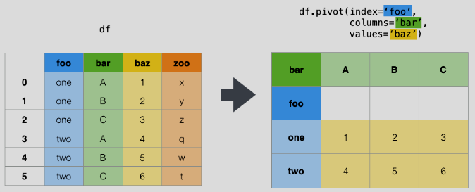
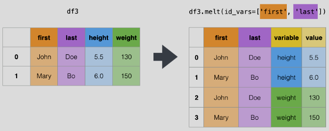
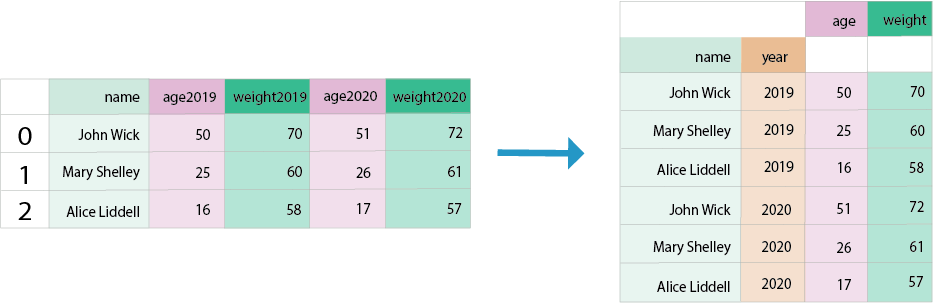

import CheatSheet from '@site/src/components/CheatSheet';

# Cheat Sheets de Pandas reshaping

<CheatSheet header="pivot">



```python
df.pivot(index='foo', columns='bar', values='baz')
```

```python
df.pivot_table(index='foo', columns='bar', values='baz', aggfunc='sum')
```
</CheatSheet>

<CheatSheet header="melt">



```python
df3.melt(id_vars=['first', 'last'], var_name='variable', 
        value_name='value')
df3.melt(id_vars=['first', 'last'], var_name='variable', 
        value_name='value', value_vars=['height', 'weight'])
```
</CheatSheet>

<CheatSheet header="Wide to long">



```python
pd.wide_to_long(df, stubnames=['age', 'weight'], i=['name'], 
                j='year')
# format age_2019
pd.wide_to_long(df, stubnames=['age', 'weight'], i=['name'], 
                j='year', sep='_', suffix='\w+')
```
</CheatSheet>